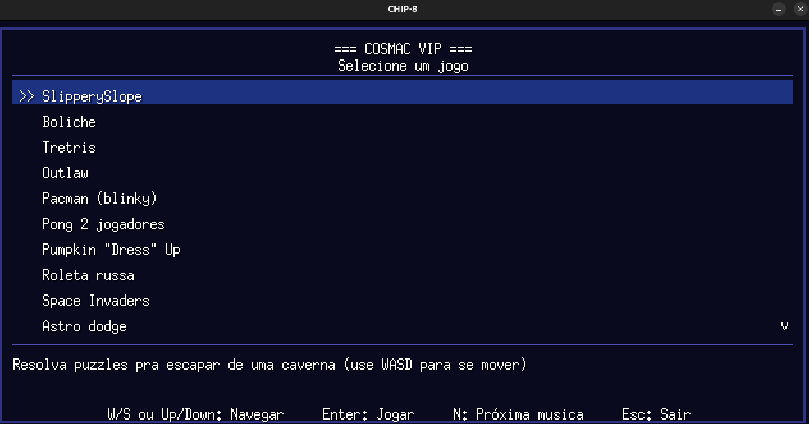
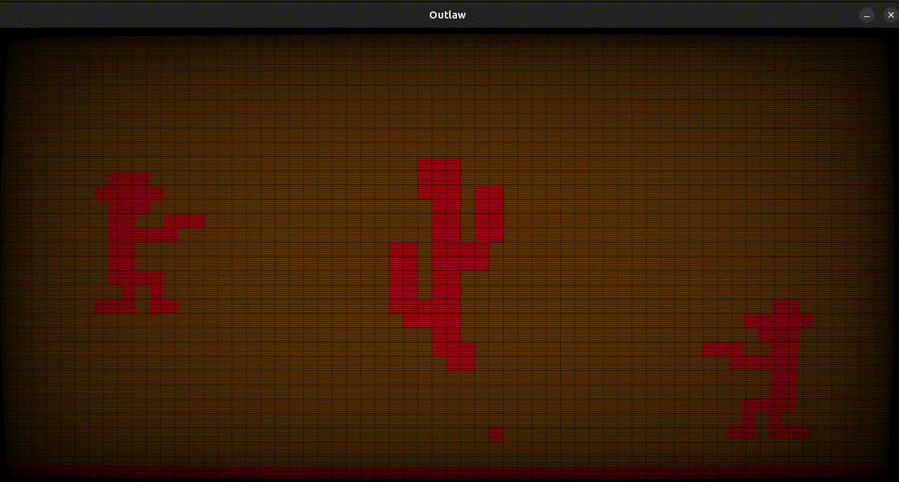

# COSMAC-VIP

## Downloads

Ubuntu ([Link](https://github.com/MoDasby/chip-8-golang/releases/download/latest/chip-8-linux-amd64)) <br>
Windows ([Link](https://github.com/MoDasby/chip-8-golang/releases/download/latest/chip-8-windows-amd64.exe))

<p align="center">
  
  
</p>

## Descrição

Aplicação feita em Golang compatível com ROMS de CHIP8, não suporta(ainda) ROMS de variações do CHIP8, como SCHIP e XOCHIP.

atualmente conta com 18 jogos criados pela comunidade e algumas músicas, criando um ambiente relaxante para passar o tempo entediado, espero que se divirta!

## Tecnologias

Foi utilizado Golang puro com Ebiten engine para renderização

## Como adicionar uma ROM?

Para adicionar uma ROM, siga esses passos:

1. crie uma pasta em `games/`com o nome do seu jogo
2. adicione a ROM na pasta recém criada
3. crie um arquivo `metadata.json`com a seguinte estrutura:

```json
{
    "name": "Astro dodge", // nome do jogo
    "folderName": "astrododge", // nome da pasta recém criada
    "description": "Desvie dos asteroides no vazio espacial (use Q e E para se mover)", // uma breve descrição do jogo para ser exibida no app
    "romLocation": "astro_dodge.ch8", // nome do arquivo da ROM
    "theme": {
        "primaryColor": "6, 10, 30", // cor primária que será usada no game, segue esse padrão: R, G, B
        "secondaryColor": "120, 220, 255" // cor primária que será usada no game, segue esse padrão: R, G, B
    },
    "order": 100 // ordem que o jogo será exibido na lista, quanto maior esse número mais alto
}
```

## Como rodar o projeto localmente?

1. Clone o projeto:
    ```bash
    git clone git@github.com:MoDasby/chip-8-golang.git
    ```

2. Instale as dependências e rode o projeto:
    ```bash
    go mod tidy
    go run .
    ```